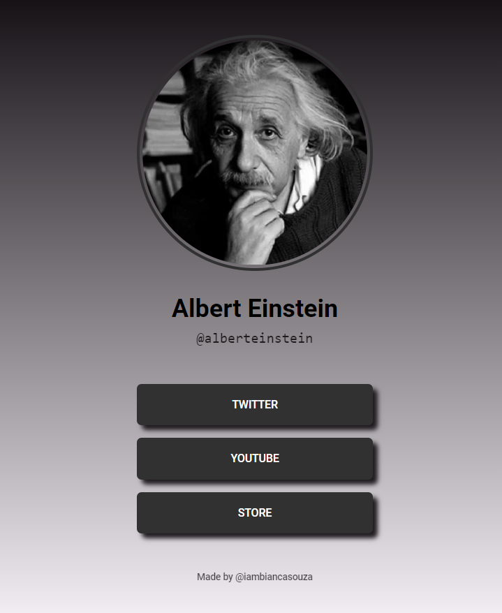

<h1 align="center"> Social-tree 🌳
 

</h1>

<h1 align="center">See me here</h1>

## About

I'm a 'social tree', as you can see. 🙂  My creator's friend asked for something very basic, so she made me (a long time ago) with all the care and respect she believed he deserved. However, only now I'm being placed here.  Well, better late than never, right? 🤷‍♀️

## Tools used on me

- HTML
- CSS

Like I said, I'm such simple.
